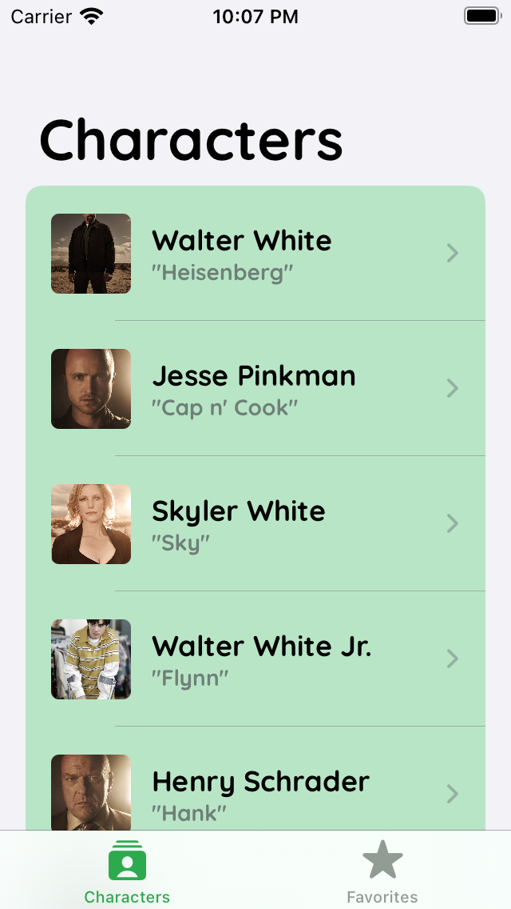
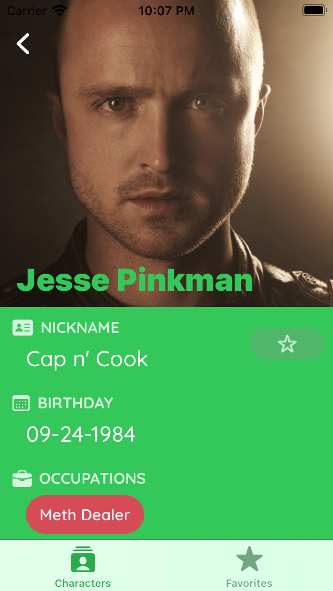
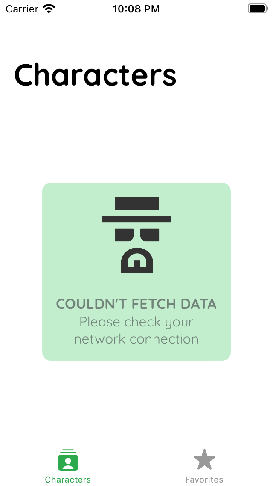
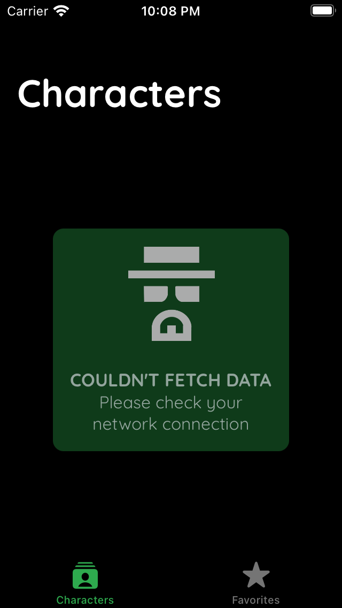

# Mandatory Assignment

In order to take part in the iPraktikum course, you need to submit an interactive iPhone app (iOS 15) developed using Xcode 13 and SwiftUI 3 as part of the Mandatory Assignment.

## Submission

-   **Clone this repository** and use it to work on your app.
-   **Follow the branching model** described in [this introductory video](https://www.youtube.com/watch?v=7TQ3xqglY80) or in [these slides](https://confluence.ase.in.tum.de/display/IOS22CW/Intro+Course%3A+Mandatory+Assignment?preview=/120160455/121474151/PR.pdf).
-   Submit your app **by creating a pull request**, which one of the tutors will review.
    -   Requirements NOT met: The tutor asks you to update your pull request.
    -   Requirements met: The tutor will accept the pull request.
-   The **Deadline** is **20.04.2022, 11:59 PM**
    -   Make sure to submit your solution **at least one week earlier**, allowing sufficient time for pull request reviews by tutors.
-   **Interviews**: **21.04.2022 - 27.04.2022**
    -   After accepting you submission, we may invite you to a short interview to ensure that you implemented your Mandatory Assignment without the help of third parties.

## Requirements

The table below lists all of the requirements to your iPhone app in a short form. Refer to the [detailed list with hints and how-to's](https://confluence.ase.in.tum.de/display/IOS22CW/Intro+Course%3A+Mandatory+Assignment) while working on your app.

After verifying that you implemented each of them, put a ✅ into the *Implemented* column before submitting the pull request for review. Don't touch the *Fulfilled* column, it will be filled by your tutor.

> Submissions without a ✅ in each row will not be reviewed but rejected for another revision.

| #  | Description                                                                         | Implemented | Fulfilled |
|----|-------------------------------------------------------------------------------------|-------------|-----------|
| 1  | Create at least 5±2 custom views                                                    |      ✅     |     ❌     |
| 1a | Use the List view in at least one of the custom views                               |      ✅     |     ✅     |
| 1b | Use AsyncImage in at least one of the custom views.                                 |      ✅     |     ✅     |
| 1c | Import and display a custom font in at least one of the custom views                |      ✅     |     ✅     |
| 2  | Include at least one asynchronous API call handled using async / await.             |      ✅     |     ✅     |
| 2a | Handle network errors and display appropriate error messages.                       |      ✅     |     ✅     |
| 3  | Use the MVVM pattern throughout your app.                                           |      ✅     |     ✅     |
| 3a | Avoid business logic in your SwiftUI views.                                         |      ✅     |     ✅     |
| 3b | Use appropriate property wrappers in your views.                                    |      ✅     |     ✅     |
| 3c | Use at least one published property in a ViewModel.                                 |      ✅     |     ✅     |
| 4  | Follow Apple's Human Interface Guidelines while creating the UI.                    |      ✅     |     ✅     |
| 4a | Support Dark Mode.                                                                  |      ✅     |     ✅     |
| 5  | Include at least one third-party package.                                           |      ✅     |     ✅     |
| 5a | Ensure that you install the package of your choice using the Swift Package Manager. |      ✅     |     ✅     |
| 6  | Use SF Symbols.                                                                     |      ✅     |     ✅     |
| 7  | Source code follows best practices, is readable, and easy to understand.            |      ✅     |     ❌     |
| 7a | Follow coding guidelines.                                                           |      ✅     |     ❌     |
| 7b | Comment your code inline.                                                           |      ✅     |     ✅     |
| 7c | Document your code.                                                                 |      ✅     |     ✅     |
| 7d | Use Apple's Logger throughout your app.                                             |      ✅     |     ✅     |

## Documentation

### Features

> This is an app that shows a list of Breaking Bad characters and details about them. There is also a search functionality that allows the user to search for the name of a character. 
> All data is fetched from the Breaking Bad API (https://breakingbadapi.com/).

### Screens

> **List Screen**\
> {height=25% width=25%}\
> Shows a list of characters, offers search functionality\
> **Detail Screen**\
> {height=25% width=25%}\
> Shows information about a single Breaking Bad character

### Requirements

#### 1) Create at least 5±2 custom views created

> I have created a `CharacterList` view that uses `CharacterCell`s to display an image of each character followed by its name and nickname. Tapping on one of the cells opens a `CharacterDetail` view which, uses a third-party package (*FancyScrollView*) to display an image of the character and several `CharacterDetailSection`s, each showing a single piece of information (birthday, occupations, etc.). The occupation section uses another custom view that I have created (`RoundedTextView`). 
> 
> If an error prevents fetching the list of characters from the API, an `ErrorView` is shown to inform the user.

#### 1a) Use the List view in at least one of the custom views

> The List view is used inside `CharacterList`

#### 1b) Use AsyncImage in at least one of the custom views.

> AsyncImage is used inside `CharacterCell` and `CharacterDetail` to show character images

#### 1c) Import and display a custom font in at least one of the custom views.

> I have imported a font called *Quicksand* with the following steps:
> 1. Added the .ttf file of the font to a folder named `fonts`
> 2. Added a "Fonts provided by the application" key, containing the name of the font file, to the Info tab of the project target
> 3. Started using the font throughout the app by calling the Font.custom(...) function

> Note: I have also created a `FontNames` enum to save the name of the default font (Quicksand) and access it from other structs and views. 

#### 2) Include at least one asynchronous API call handled using async / await.

> The `fetchData()` function inside `CharacterListViewModel` is an asynchronous function that makes an API call to fetch the list of characters. This function is called inside `CharacterList`.

#### 2a) Handle network errors and display appropriate error messages.

> If, for some reason, the list of characters can't be fetched, the application shows an `ErrorView` instead of the list of characters to inform the user:
> {height=25% width=25%}\

#### 3) Use the MVVM pattern throughout your app.

> The list of characters and the logic for fetching them from the API is inside the `CharacterListViewModel`.

#### 3a) Avoid business logic in your SwiftUI views.

> Done

#### 3b) Use appropriate property wrappers in your views.

> I have used `@Published`, `@State`, `@StateObject`, and `@Binding` wrappers.

#### 3c) Use at least one published property in a ViewModel.

> `CharacterListViewModel` contains a `@Published` property

#### 4) Follow Apple's Human Interface Guidelines while creating the UI.

> I have read and did my best to align my app with Apple's Human Interface Guidelines (https://developer.apple.com/design/human-interface-guidelines/)

#### 4a) Support Dark Mode.

> All views support dark mode:
> 
> **List Screen**\
> {height=25% width=25%}\
> **Detail Screen**\
> {height=25% width=25%}\
> **List Screen (with error)**\
> {height=25% width=25%}

#### 5) Include at least one third-party package.

> I have used a package called FancyScrollView. You can find more about it [here](https://github.com/nerdsupremacist/FancyScrollView)

#### 5a) Ensure that you install the package of your choice using the Swift Package Manager.

> I have used File -> Add Packages menu in Xcode 13 to install the package.

#### 6) Use SF Symbols.

> `CharacterDetail` screen includes several `CharacterDetailSection`s with various SF Symbols each describing a section.

#### 7) Source code follows best practices, is readable, and easy to understand.

> I ensured this by following the following guide: [Swift API Design Guidelines](https://www.swift.org/documentation/api-design-guidelines/)

#### 7a) Follow coding guidelines.

> Done

#### 7b) Comment your code inline.

> All swift files contain comments

#### 7c) Document your code.

> The repository contains a descriptive README file

#### 7d) Use Apple's Logger throughout your app.

> I have used Logger in the `CharacterListViewModel` to log some information regarding the process of fetching data from the API. 
